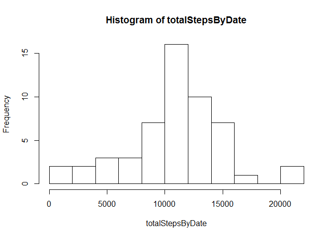
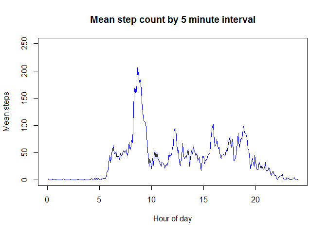
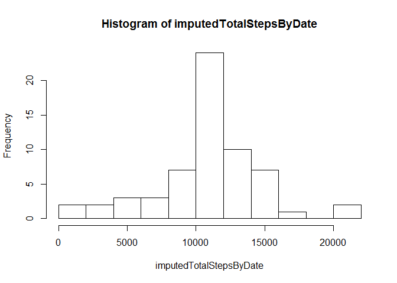
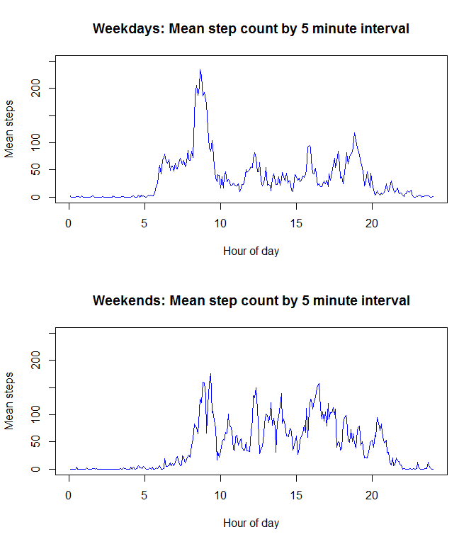

# Reproducible Research: Peer Assessment 1

In activity data gathered from fitness sensors, we discover a previously unimagined 
pattern ofactivity with disturbing implication for mental health practitioners: 
Early morning exercise.

## Loading and preprocessing the data


```r
data = read.csv( "activity.csv" )
dim(data)
```

```
## [1] 17568     3
```

```r
summary( data )
```

```
##      steps                date          interval     
##  Min.   :  0.00   2012-10-01:  288   Min.   :   0.0  
##  1st Qu.:  0.00   2012-10-02:  288   1st Qu.: 588.8  
##  Median :  0.00   2012-10-03:  288   Median :1177.5  
##  Mean   : 37.38   2012-10-04:  288   Mean   :1177.5  
##  3rd Qu.: 12.00   2012-10-05:  288   3rd Qu.:1766.2  
##  Max.   :806.00   2012-10-06:  288   Max.   :2355.0  
##  NA's   :2304     (Other)   :15840
```

```r
s1 <- sum( data$steps, na.rm = TRUE )
```

## What is mean total number of steps taken per day?


```r
totalStepsByDate <- aggregate( steps ~ date, data, sum )$steps
s2 <- sum( totalStepsByDate, na.rm = TRUE )
if( s1 != s2 ) stop( "Checksum mismatch");
hist( totalStepsByDate, bins <- 15) 
```

 

```r
mean( totalStepsByDate )
```

```
## [1] 10766.19
```

```r
median( totalStepsByDate )
```

```
## [1] 10765
```

This histogram reveals a roughly Gaussian distribution of daily activity levels, 
consistent with a model that views the daily activity level as a sum of 
multiple independent variables.

## What is the average daily activity pattern?


```r
aggregateDataByInterval <- function( df ) {
  aggregate( steps ~ interval, df, mean)
}

byIntervalPlot <- function( aggregatedDf) {
  plot( c(1:length( aggregatedDf$steps)) / 12, aggregatedDf$steps, type="l", col="blue", 
        ylim = c(0,250), ylab = "Mean steps", 
        xlab="Hour of day")
}

meanStepsByInterval <- aggregateDataByInterval( data )
summary( meanStepsByInterval )
```

```
##     interval          steps        
##  Min.   :   0.0   Min.   :  0.000  
##  1st Qu.: 588.8   1st Qu.:  2.486  
##  Median :1177.5   Median : 34.113  
##  Mean   :1177.5   Mean   : 37.383  
##  3rd Qu.:1766.2   3rd Qu.: 52.835  
##  Max.   :2355.0   Max.   :206.170
```

```r
byIntervalPlot( meanStepsByInterval )
title( main="Mean step count by 5 minute interval")
```

 

```r
#barplot( meanStepsByInterval$steps )

#maximizer and maximum
meanStepsByInterval[ which.max( meanStepsByInterval$steps ),]
```

```
##     interval    steps
## 104      835 206.1698
```

```r
# A table of intervals with relatively high mean step counts
meanStepsByInterval[ meanStepsByInterval$steps > 90, ]
```

```
##     interval     steps
## 99       810 129.43396
## 100      815 157.52830
## 101      820 171.15094
## 102      825 155.39623
## 103      830 177.30189
## 104      835 206.16981
## 105      840 195.92453
## 106      845 179.56604
## 107      850 183.39623
## 108      855 167.01887
## 109      900 143.45283
## 110      905 124.03774
## 111      910 109.11321
## 112      915 108.11321
## 113      920 103.71698
## 114      925  95.96226
## 147     1210  94.84906
## 148     1215  92.77358
## 190     1545  98.66038
## 191     1550 102.11321
## 226     1845  99.45283
```

This plot shows high activity during the 8 a.m. hour, a distinct peak of activity 
around 8:35 a.m.. Otherwise, we note a moderate level 
of activity between 6 a.m. and 7 p.m with a few local maxima, and 
almost no activity bewteen 11 p.m. and 5 a.m.. 

These data do not enable us to assess whether high morning level is 
due to a large number of neurotic morning exercisers, whether it
reflects the pathologically elevated activity levels of a relatively small number 
of such troubled individuals, or a combination of the two. Resolving this 
key question appears problematic, owing to the difficulty of conducting 
reliable research in such grueling morning conditions.

## Imputing missing values

The missing data in the dataset consists of entire days for which 
no data was reported on any 5-minute interval, as the calculations below demonstrate.
We discern no simple pattern in the missing days.


```r
missingData <- data[ is.na( data$steps ), ]

missingByDate <- table( missingData$date )

which( missingByDate > 0 )
```

```
## 2012-10-01 2012-10-08 2012-11-01 2012-11-04 2012-11-09 2012-11-10 
##          1          8         32         35         40         41 
## 2012-11-14 2012-11-30 
##         45         61
```

```r
which( missingByDate >0 && missingByDate != 288 )
```

```
## integer(0)
```

Accordintly, we model missing step counts as the corresponding average 
for the same interval for days with data. 


```r
# Compute the index ( 1:288 ) of a given interval.
# interval "210" is the 3rd inteval of the second hour: 0-55, 100-155, 200, 205, 210"
# So intervalNum( 210 ) -> 27.

intervalNum <- function( interval ) {
  hour <- floor( interval / 100 )
  min <- interval - hour * 100
  hour * 12 + min / 5 + 1
}

# For missing data, default to the mean for the corresponding interval
imputedValue <- function( steps, interval ) { 
  ifelse( is.na(steps), meanStepsByInterval[intervalNum(interval), 2], steps ) 
}

# Add column for data merged with imputed data.
data$imputedSteps <- mapply( imputedValue, data$steps, data$interval )

# Test: missing values are imputed, since first day has no data
norm( as.matrix( data$imputedSteps[1:288] - meanStepsByInterval[1:288,2] ) ) # -> 0
```

```
## [1] 0
```

```r
# Test: present values are left alone
norm( as.matrix( data$imputedSteps[2400:2430] - data$steps[2400:2430] ) ) # -> 0
```

```
## [1] 0
```

```r
imputedTotalStepsByDate <- aggregate( imputedSteps ~ date, data, sum )$imputedSteps

hist( imputedTotalStepsByDate, bins <- 15)
```

 

## Are there differences in activity patterns between weekdays and weekends?

To answer this question, we introduce a factor that is 1 on weekdays and 2 on weekends.


```r
isWeekday <- function( dateString ) {
  weekdays( as.POSIXlt( dateString ) ) %in% c( "Saturday", "Sunday" )
}

# Create weekend/weekday factor, split on it, and label the splits frames.
data$isWeekday <- mapply( isWeekday, data$date)
splitData <- split( data, data$isWeekday )
weekdayData <- splitData[[1]]
weekendData <- splitData[[2]]

# Difference in means for split
weekdayMean <- mean( weekdayData$steps, na.rm = TRUE )
weekendMean <- mean( weekendData$steps, na.rm = TRUE )
weekendLevelIncrease <- round( 100 * (weekendMean - weekdayMean ) / weekdayMean, 2 )

# Compute average steps per interval for split
meanStepsByIntervalWeekday <- aggregateDataByInterval( weekdayData )
meanStepsByIntervalWeekend <- aggregateDataByInterval( weekendData )

# Panel plot
par( mfrow=c(2,1))
byIntervalPlot( meanStepsByIntervalWeekday )
title( main = "Weekdays: Mean step count by 5 minute interval" )
byIntervalPlot( meanStepsByIntervalWeekend )
title( main = "Weekends: Mean step count by 5 minute interval" )
```

 

In summary, on Saturdays and Sundays, the average activity level 
increases 21.9 from 35.34 to 43.08 
steps per interval. On weekends, the pathological early morning activity, 
while still significant, is reduced, the activity apparently distributed across later 
parts of the day and into the evening.
